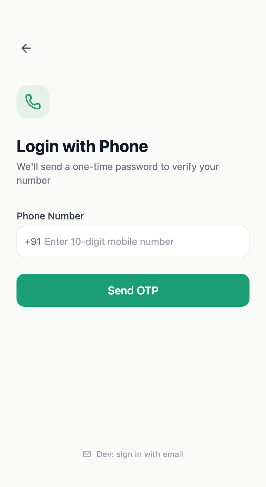
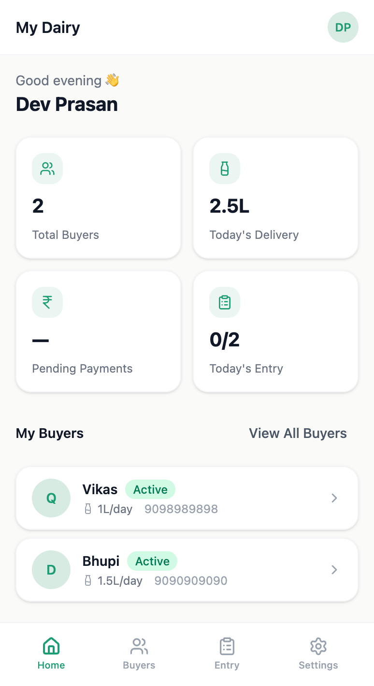

# MilkBook — Technical Documentation

*Apna dudh, apna hisaab.* A PWA for milk delivery tracking between dairy sellers and their buyers.

<p align="center">
  
  
</p>

---

## User Flows

### Seller flow
1. **Login** (`/login`) — OTP via Firebase Phone Auth
2. **Role select** (`/role-select`) — writes `role: 'seller'` to `users/{uid}` and creates `sellers/{uid}` doc
3. **Onboarding** (`/onboarding`) — sets `name`, `about`, `homeDelivery`; optionally sets global prices per cattle type in `sellerPrices/{uid}/prices/global_{type}`
4. **Dashboard** (`/seller`) — daily summary: total litres today, pending payments, buyer count
5. **Daily entry** (`/seller/entry`) — select buyer → enter morning/evening quantities per cattle type → saves to `records/{sellerId}/entries/{recordId}`
6. **Buyer management** (`/seller/buyers`) — add/edit/deactivate buyers; each buyer lives in `sellerBuyers/{sellerId}/members/{buyerId}`
7. **Billing** (`/seller/buyers/:buyerId`) — view monthly bill, record payments, share via WhatsApp

### Buyer flow
1. Login → role select (`role: 'buyer'`) → onboarding
2. **Dashboard** (`/buyer`) — summary across all linked sellers
3. **My records** (`/buyer/records`) — view records per seller per month; can also add self-entries to `buyerSelfRecords/{buyerId}/entries/`
4. **Nearby sellers** (`/buyer/nearby`) — geolocation-based seller discovery; sends `linkRequests` doc

---

## Environment Variables

All Firebase config via `VITE_FIREBASE_*` in `.env`:

```
VITE_FIREBASE_API_KEY
VITE_FIREBASE_AUTH_DOMAIN
VITE_FIREBASE_PROJECT_ID
VITE_FIREBASE_STORAGE_BUCKET
VITE_FIREBASE_MESSAGING_SENDER_ID
VITE_FIREBASE_APP_ID
```

---